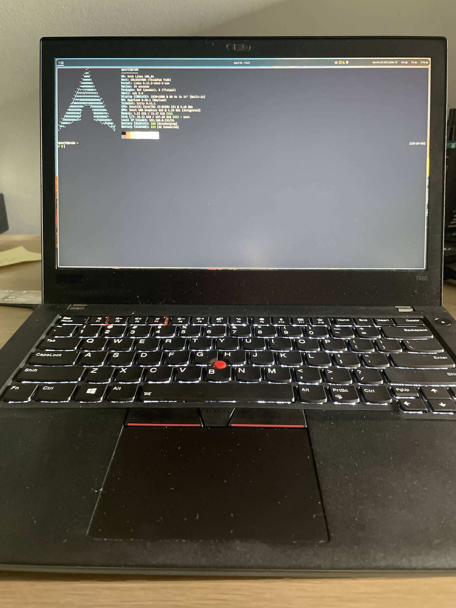
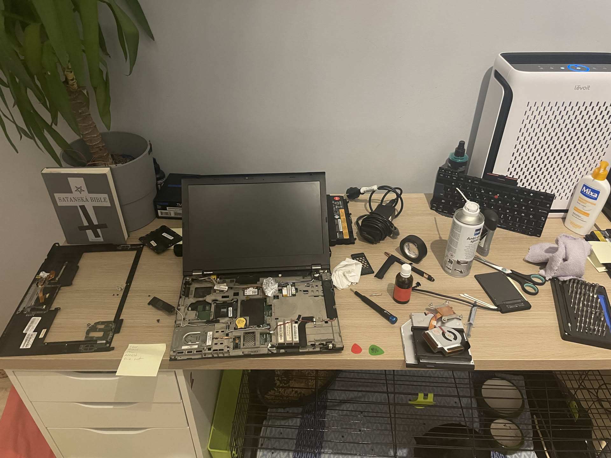

## How it all started

I've been a Linux user for quite some time now, and it's impossible to be a Linux die-hard without encountering ThinkPads. My journey with ThinkPads began several years ago when I got my first one, a ThinkPad T480.

## My ThinkPad T480

This is where my ThinkPad adventure began. The T480 is an excellent laptop, in fact, I'm writing this part on it right now!

It's built like a tank, but not a big tank, a relatively slim, portable tank (compared to the T420).
And it has a fantastic keyboard, as all older ThinkPads do.

_My trusty ThinkPad T480_

### New Keyboard Installation

The keyboard it came with was already really nice, but the only problem it had was that it had a German layout, and I didn't like that <kbd>CTRL</kbd> was named
<kbd>STRG</kbd>. So I ordered a new keyboard with the US layout from AliExpress and installed it.
I was fairly surprised how easy it was. It took me like 10 minutes, you just remove a few screws on the bottom, and then u just push the keyboard out from the top with your fingers.
You can watch this video tutorial I followed:

<iframe width="560" height="315" src="https://www.youtube.com/embed/Ilni8Em7rsg" title="ThinkPad T480 keyboard replacement guide" frameborder="0" allowfullscreen></iframe>

## My ThinkPad Refurbishing Project

Over the summer of 2025, I decided to take on a refurbishing project rescuing old ThinkPads.
I manager to fix and refurbish 3 different ThinkPads, and then I gave up, because i got scammed by a guy on Facebook Marketplace while trying to buy a ThinkPad X270.

### ThinkPad T420

This was the first ThinkPad I had to refurbish. It wasn't in too bad of shape, it just needed repasting, new RAM and an SSD.
But boy oh boy was the teardown process a nightmare. The T420 is infamous for being hard to disassemble, and I can confirm that it is indeed a pain.

_The rescue process of the ThinkPad T420_

### Thinkpad X270

This one I bought from a listing saying that it's not working.
When I got it, It did turn on, but when i moved it around, it turned off randomly.

The problem that fixed it was isolating the motherboard from the metal chassis with some electrical tape.
That fixed it for a bit, but then it started happening again.

To this day I'm still not sure what the actual problem was, but I think it was either a short circuit on the motherboard, or a bad battery connection.

I'm sorry to my classmate who I sold it to, I hope he can find a way to fix it.

## Thinkpad X230: My Final ThinkPad

This is my latest ThinkPad project, It hasn't arrived yet, but I'm really excited about it.
I got it for 2000 CZK (80 €), which is a steal for a ThinkPad X230 in good condition.
It comes with an i5-3320M, 16GB of RAM and a 512GB SSD. It also has a usb-c power delivery mod, which is a nice bonus.

### What I'm going to do to it

I'm planning to do a full refurbish on it, including repasting, cleaning, and replacing the plastic parts with ones from a X220.

I'm also going to replace the keyboard with the one from a X220, because the X230 keyboard is not as good as the X220 one (you know I had to).
Also I had to replace the palmrest, because I would have to file down the keyboard to fit in, and also it wouldn't have been a perfect fit, there would be
a gap at the top.

The palmrest Also had a fingerprint scanner built in, so count that as an upgrade.

### How to do what I'm doing

If you want to also do this with your ThinkPad X230, I'm gonna provide you with some materials I gathered while planning this project, as well as some
useful YouTube videos.

#### Parts needed

- ThinkPad X220 keyboard
- ThinkPad X220 palmrest
- USB-C Power Delivery mod
- BIOS version under 2.70 (to support the mod)

#### Keyboard mod required steps

> [!TIP]
> You should probably watch the youtube video instead of just following these steps, these are just so you have a general idea of what to do.

1. Remove the old keyboard from the X230 by removing the screws on the bottom and pushing it out from the top.
2. Remove the X230 palmrest by removing two screws on the bottom and disconnecting the touchpad cable.
3. Tape off components on the X220 keyboard that could potentially short circuit with the X230 motherboard.
4. Put in the X220 palmrest into the X230 chassis, it should fit without any problems.
5. Connect the touchpad cable from the X230 to the X220 palmrest.
6. Connect the fingerprint scanner cable from the X230 to the X220 keyboard.
7. Put in the X220 keyboard into the X230 chassis, it should fit without any problems.

<iframe width="560" height="315" src="https://www.youtube.com/embed/t4_6LQrmu14" title="Building the Perfect ThinkPad X230 Part 2: Keyboard Swap" frameborder="0" allowfullscreen></iframe>

_ThinkPad X230 keyboard and palmrest swap guide_

<iframe width="560" height="315" src="https://www.youtube.com/embed/oDAcAvCY7bo" title="Laptop Lenovo Thinkpad X230 mod add type C Power Delivery" frameborder="0" allowfullscreen></iframe>

_ThinkPad X230 USB-C mod_

